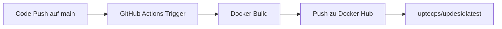
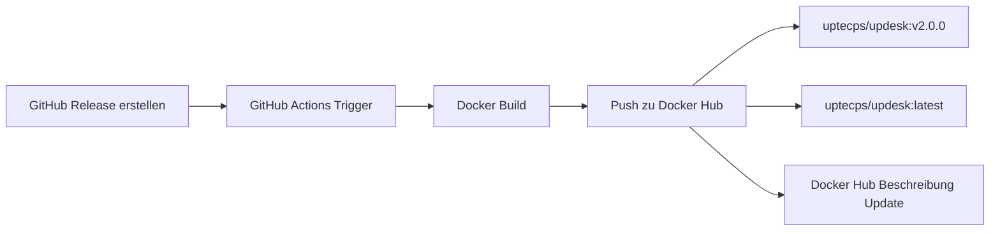

# 🐳 Docker Workflow Strategie

## Übersicht

Der GitHub Actions Workflow für UpDesk implementiert eine **Dual-Trigger-Strategie** für maximale Flexibilität und kontinuierliche Bereitstellung.

## 📋 Workflow-Szenarien

### 1️⃣ Push auf `main` Branch → `latest` Tag Update



**Wann:** Bei jedem `git push origin main`

**Was passiert:**
- ✅ Automatischer Build für `linux/amd64` und `linux/arm64`
- ✅ Push nur des `latest` Tags
- ✅ Schnelle Bereitstellung der neuesten Entwicklungsversion
- ❌ Keine Docker Hub Beschreibungsaktualisierung
- ❌ Keine versionierten Tags

**Verwendung:**
```bash
# Entwickler pusht Code
git push origin main

# Nutzer zieht neueste Version
docker pull uptecps/updesk:latest
```

---

### 2️⃣ GitHub Release → Versionierte Tags + `latest`



**Wann:** Bei Veröffentlichung eines GitHub Releases

**Was passiert:**
- ✅ Automatischer Build für `linux/amd64` und `linux/arm64`
- ✅ Push des Release-Tags (z.B. `v2.0.0`)
- ✅ Push des `latest` Tags
- ✅ Docker Hub Beschreibungsaktualisierung
- ✅ Detaillierte Build Summary mit Release-Informationen

**Verwendung:**
```bash
# Maintainer erstellt Release
git tag -a v2.0.0 -m "Release v2.0.0"
git push origin v2.0.0
# Dann auf GitHub: Release veröffentlichen

# Nutzer zieht spezifische Version
docker pull uptecps/updesk:v2.0.0

# Oder neueste stabile Version
docker pull uptecps/updesk:latest
```

---

## 🎯 Vorteile dieser Strategie

### Für Entwickler
- 🚀 **Continuous Deployment**: Jeder Push auf `main` ist sofort verfügbar
- 🔄 **Automatisierung**: Kein manuelles Docker-Building mehr nötig
- 📦 **Multi-Platform**: Automatische Builds für AMD64 und ARM64

### Für Nutzer
- 🆕 **Immer aktuell**: `latest` Tag wird bei jedem Push aktualisiert
- 🔒 **Stabile Versionen**: Versionierte Tags für Produktionsumgebungen
- 🎯 **Flexibilität**: Wahl zwischen neuester Entwicklung oder stabiler Version

### Für Wartung
- 📝 **Versionierung**: Klare Trennung zwischen Entwicklung und Releases
- 🏷️ **Tag-Management**: Automatische Verwaltung aller Tags
- 📊 **Nachverfolgbarkeit**: Build Summaries für jeden Build

---

## 📊 Tag-Strategie

| Tag | Quelle | Aktualisierung | Verwendung |
|-----|--------|----------------|------------|
| `latest` | Push auf `main` **oder** Release | Bei jedem Push/Release | Entwicklung & Testing |
| `v2.0.0` | GitHub Release v2.0.0 | Nur bei Release-Erstellung | Produktion (spezifische Version) |
| `v2.1.0` | GitHub Release v2.1.0 | Nur bei Release-Erstellung | Produktion (spezifische Version) |

---

## 🔧 Konfiguration

### Erforderliche GitHub Secrets

| Secret | Wert | Beschreibung |
|--------|------|--------------|
| `DOCKER_USERNAME` | `uptecps` | Docker Hub Benutzername |
| `DOCKER_PASSWORD` | `***` | Docker Hub Access Token |

### Workflow-Datei

Siehe: `.github/workflows/docker.yml`

---

## 📖 Beispiel-Workflows

### Entwicklungs-Workflow

```bash
# 1. Feature entwickeln
git checkout -b feature/neue-funktion
# ... Code ändern ...
git commit -m "feat: neue Funktion"

# 2. Auf main mergen
git checkout main
git merge feature/neue-funktion

# 3. Pushen → Automatischer Build!
git push origin main

# 4. Nach ~10-15 Minuten verfügbar
docker pull uptecps/updesk:latest
```

### Release-Workflow

```bash
# 1. Version in package.json aktualisieren
npm version 2.0.0

# 2. Tag erstellen
git tag -a v2.0.0 -m "Release v2.0.0 - Neue Features"

# 3. Tag pushen
git push origin v2.0.0

# 4. Auf GitHub Release erstellen
# → Gehe zu GitHub → Releases → Draft a new release
# → Wähle Tag v2.0.0
# → Füge Changelog hinzu
# → Publish release

# 5. Nach ~10-15 Minuten verfügbar
docker pull uptecps/updesk:v2.0.0
docker pull uptecps/updesk:latest  # Auch aktualisiert!
```

---

## 🚨 Wichtige Hinweise

### ⚠️ `latest` Tag Bedeutung

Das `latest` Tag zeigt **IMMER** auf die neueste Version:
- Bei Push auf `main`: Neueste Entwicklungsversion
- Bei Release: Neueste stabile Version

**Empfehlung für Produktion:**
- Verwende **versionierte Tags** (z.B. `v2.0.0`) für Stabilität
- Verwende `latest` nur für Entwicklung/Testing

### 🔄 Build-Zeiten

- **AMD64**: ~5-8 Minuten
- **ARM64**: ~10-15 Minuten (QEMU-Emulation)
- **Gesamt**: ~15-20 Minuten pro Build

### 💾 Cache-Strategie

Der Workflow nutzt GitHub Actions Cache:
- Erste Builds: Langsamer (~20 Min)
- Folgende Builds: Schneller (~10-15 Min)
- Cache wird automatisch verwaltet

---

## 📚 Weitere Ressourcen

- **Workflow README**: `.github/workflows/README.md`
- **Docker README**: `DOCKER-README.md`
- **GitHub Actions**: https://github.com/uptecps/updesk/actions
- **Docker Hub**: https://hub.docker.com/r/uptecps/updesk

---

**Automatisierte Docker-Builds für UpDesk! 🚀**